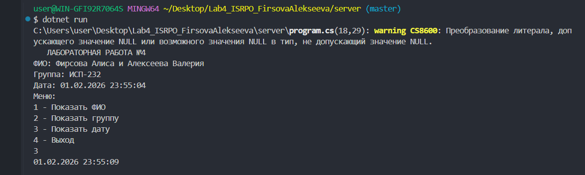
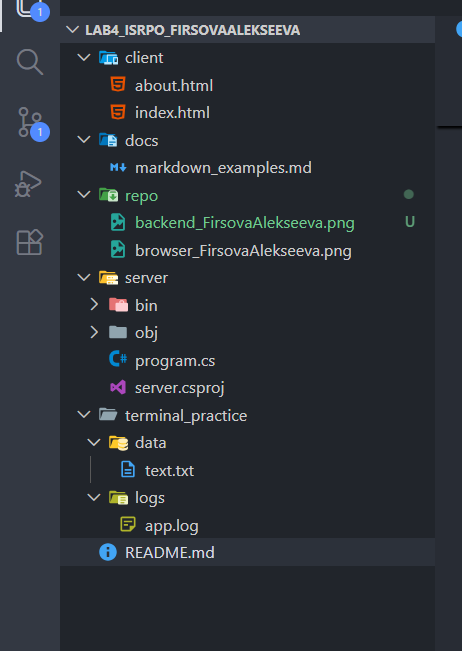

# Лабораторная работа № 4
### **ФИО:** Фирсова и Алексеева
### **Группа:** ИСП-232
### **Дата:** 01.02.2026
## Описание проекта
Данный проект представляет собой лабораторную работу №4 по курсу "Информационные системы и программирование". Цель работы — закрепить навыки работы с Git, Markdown, терминалом и организацией проектной структуры.
## Содержание
1. [Структура проекта](#структура-проекта)
2. [Примеры Markdown](#примеры-markdown)
3. [Примеры LaTeX](#примеры-latex)
4. [Скриншоты](#скриншоты)
5. [Ссылка на репозиторий](#ссылка-на-репозиторий)
6. [Заключение](#заключение)
   
## Структура проекта
`README.md` - файл с документацией

`client` -папка с html-файлами

`docs` - папка с markdown

`repo` - папка со скриншотами

`server` - program.cs

`terminal_practice` - txt-файлы
## Примеры Markdown
### Заголовки

# Главный заголовок
## Второй уровень
### Третий уровень

### Список
1. Первый пункт
2. Второй пункт
3. Третий пункт
###  Картинка

### Код
```csharp
string name="Фирсова Алиса и Алексеева Валерия";
string group = "ИСП-232";
 Console.WriteLine($"ФИО: {name}");
  Console.WriteLine($"Группа: {group}");
 Console.WriteLine($"Дата: {DateTime.Now}");
```
## Пример LaTeX
Площадь круга: $S = \pi r^2$
## Ссылка на репозиторий
 [Внешняя ссылка на GitHub](https://github.com/Firsoova08/Lab4_ISRPO_FirsovaAlekseeva.git)

 ## Скриншоты 
 
 
 
 ## Заключение
 В ходе выполнения лабораторной работы №4 были успешно закреплены навыки работы с:

- Git — система контроля версий (16+ коммитов)

- Markdown — язык разметки для документации

- Терминалом — создание структуры и работа с файлами

- Проектной структурой — организация frontend и backend частей

Все требования лабораторной работы выполнены в полном объёме. Проект демонстрирует понимание основных принципов разработки ПО и ведения документации.