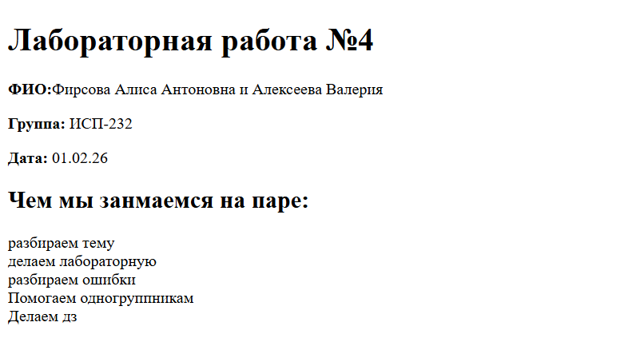

# Примеры Markdown

## 1. Заголовки
# H1
## H2
### H3
#### H4
##### H5
###### H6

---

## 2. Горизонтальные линии
Первая часть
---
Вторая часть
***
Третья часть

---

## 3. Форматирование текста
- **Жирный**
- *Курсив*
- ~~Зачёркнутый~~
- `Моноширинный`
- ***Жирный курсив***

---

## 4. Списки

### Маркированный
- Пункт 1
- Пункт 2
- Пункт 3

### Нумерованный
1. Первый
2. Второй
3. Третий

### Вложенный
- Основной
  - Вложенный
    - Ещё уровень
  - Второй вложенный
- Другой основной
  1. Нумерованный вложенный
  2. Ещё один

---

## 5. Цитаты
> Это пример цитаты.
> Вторая строка цитаты.

---

## 6. Блоки кода
```bash
git status
```
## 7. Таблицы
| Язык           | Год описания | Автор |
|----------------|------------|----------|
|  Markdown      | 2004   | Джон Груббер |
|   Python       |  1991  | Гвидо ван Россум |
|   LaTeX        | 1985   | Лесли Лэмпорт |
## 8. Картинка из папки repo/

## 9. Ссылки
- [Внешняя ссылка на GitHub](https://github.com/Firsoova08/Lab4_ISRPO_FirsovaAlekseeva.git)
- [Внутренняя ссылка на блок-кода](#Блок)
  ## 10. Чекбоксы
- [x] Создать файлы
- [x] Реализовать лабораторную
- [ ] Сделать коммит выполненой работы
  ## 11. Alert-блоки GitHub
  > [!NOTE]
  >Пример

  ## 12. Inline LaTeX
  $a^2 + b^2 = c^2$

  ## 13. Block LaTeX
$$
\sum_{i=1}^n i = \frac{n(n+1)}{2}
 $$